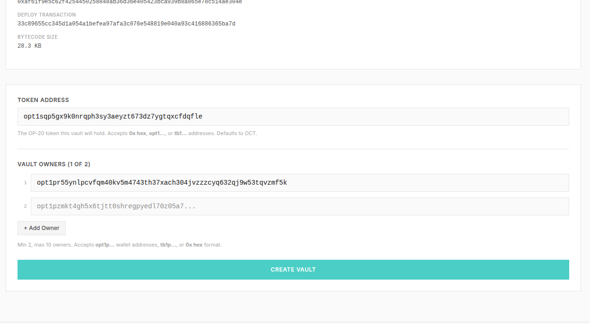
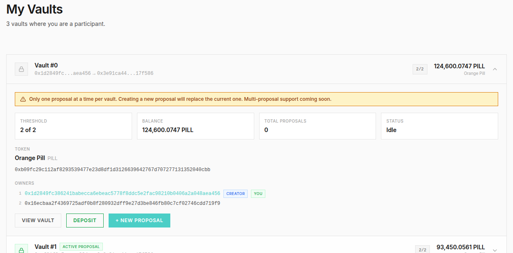
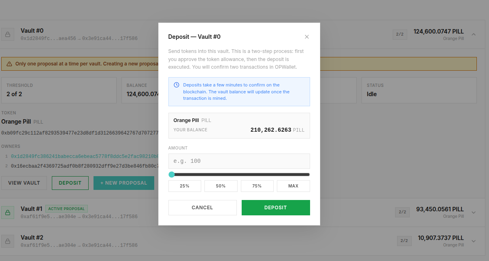
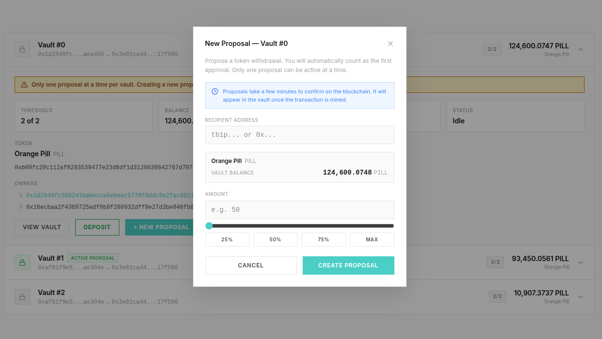
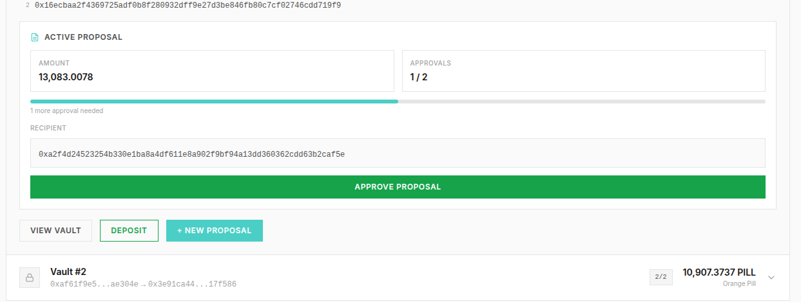

# OctoSig — Multisig Vault on OPNet (Bitcoin L1)

> **Built with [Bob](https://ai.opnet.org/mcp)** — OPNet's official AI assistant via MCP (Model Context Protocol). Bob was instrumental throughout development, providing real-time guidance on OPNet's AssemblyScript contract patterns, storage key design, gas optimization strategies, correct SDK usage, and post-quantum signing flows. Having a domain-specific AI that understands the protocol deeply made it possible to ship a working multisig vault on a brand-new chain in record time.

---

**Competition**: [vibecode.finance/apps/o-mm3v4ija](https://vibecode.finance/apps/o-mm3v4ija)
**Live App**: [octosig.locker](https://octosig.locker/)
**Twitter**: [@HashZeroSz](https://x.com/HashZeroSz/status/2027104788182126660)

---

## What is OctoSig?

OctoSig is a **multisignature vault** for OP-20 tokens on [OPNet](https://opnet.org) — Bitcoin's L1 consensus layer for trustless smart contracts. It allows a group of 2-10 owners to co-manage a shared token treasury where withdrawals require N-of-M approval before execution.

No single person can move funds alone. Every withdrawal is a proposal that must be reviewed and approved by enough owners to meet the configured threshold.

### Why Multisig?

| Problem | Single Wallet | OctoSig Vault |
|---|---|---|
| Key lost | Funds gone forever | Other owners still have access |
| Key stolen | Everything drained | Attacker can't act alone |
| Team treasury | One person controls all | All members co-control |
| Mistakes | Irreversible | Others review before execution |

---

## How to Use OctoSig (Step by Step)

### Prerequisites

- **OPWallet** browser extension installed ([opwallet.org](https://opwallet.org))
- Some testnet BTC for gas (use the [OPNet Faucet](https://faucet.opnet.org/) — "BTC" tab)
- Some OP-20 tokens to deposit (use the [OPNet Faucet](https://faucet.opnet.org/) — "OP-20" tab for free PILL tokens, or mine OCT from the app)

### Step 1: Connect Your Wallet

Click "Connect Wallet" in the top bar. OPWallet will prompt you to approve the connection. Your wallet address will appear in the header once connected.

### Step 2: Create a Vault

1. Navigate to the **"New Vault"** page
2. **Token Address** — The OP-20 token this vault will hold. Defaults to OCT. You can paste any OP-20 contract address (`0x...` hex or `opt1...` bech32)
3. **Owners** — Add 2-10 wallet addresses. Your connected wallet is auto-filled as Owner 1. Each owner needs an `opt1p...` wallet address (their OPNet taproot address)
4. **Threshold** — The minimum number of approvals required to execute a withdrawal (minimum 2)
5. Click **"Create Vault"** and confirm in OPWallet

The vault will appear on the "My Vaults" page after the transaction is mined (1-3 minutes).



### Step 3: View Your Vaults

After creation, go to **"My Vaults"** to see all vaults where you are an owner. Each vault shows its ID, token, balance, threshold, and whether there's an active proposal. Expand any vault to manage it.



### Step 4: Deposit Tokens

1. Expand your vault and click **"Deposit"**
2. Enter the amount of tokens to deposit — use the slider or quick buttons (25%, 50%, 75%, MAX)
3. Confirm the transaction — this calls `increaseAllowance` then transfers tokens into the vault

The vault's balance updates after the transaction is mined.



### Step 5: Create a Withdrawal Proposal

1. Click **"+ New Proposal"** on your vault
2. Enter the **recipient address** — where the tokens should be sent
3. Enter the **amount** to withdraw — use the slider or quick buttons
4. Click **"Create Proposal"** and confirm

**Important rules about proposals:**
- Creating a proposal **automatically counts as your approval** (you vote yes by default)
- Each vault can only have **one active proposal at a time**
- Creating a new proposal **replaces and deletes the existing one** — all previous votes are wiped
- Only vault owners can create proposals
- The proposed amount must not exceed the vault's balance



### Step 6: Approve the Proposal

Other owners need to approve the proposal:

1. They go to **"My Vaults"** and expand the vault
2. The active proposal shows the recipient, amount, current approval count, and a progress bar
3. Click **"Approve Proposal"** and confirm in OPWallet
4. Each owner can only approve once per proposal



### Step 7: Execute the Withdrawal

Once the approval count reaches the threshold:

1. **Anyone** (not just owners) can click **"Execute"**
2. This triggers the actual token transfer from the vault to the recipient
3. The proposal is deleted after successful execution
4. The vault's balance decreases by the transferred amount

The execute button is disabled until the threshold is met.

### Full Lifecycle Example (2-of-3 Vault)

```
Alice creates vault → 3 owners (Alice, Bob, Carol), threshold = 2
Alice deposits 1000 PILL tokens into the vault
Alice proposes: send 200 PILL to Dave  (auto-votes yes → 1/2 approvals)
Bob approves the proposal              (→ 2/2 approvals, threshold met!)
Carol (or anyone) clicks Execute       (→ 200 PILL sent to Dave)
```

---

## Project Structure

```
octosig/
├── contracts/          # AssemblyScript smart contracts (compiled to WASM)
│   ├── src/
│   │   ├── vault/      # MultSigVault — the core multisig contract
│   │   ├── oct/        # OctToken (OCT) — OP-20 test token with free mine()
│   │   ├── alpha/      # AlphaToken — original test token (deprecated)
│   │   └── beta/       # BetaToken — original test token (deprecated)
│   ├── scripts/        # Deployment scripts
│   └── asconfig.json   # AssemblyScript compiler config
│
├── frontend/           # Next.js 16 + React 19 + TypeScript web app
│   ├── src/
│   │   ├── app/        # Next.js app router pages
│   │   ├── components/ # React components
│   │   ├── contexts/   # Wallet + Toast context providers
│   │   └── lib/        # Contract ABIs, addresses, helpers
│   └── package.json
│
└── README.md           # You are here
```

---

## Smart Contracts

All contracts are written in **AssemblyScript** and compiled to WebAssembly for deterministic execution on Bitcoin via OPNet. Method selectors use SHA256 (first 4 bytes), not Keccak256.

### MultSigVault (`contracts/src/vault/MultSigVault.ts`)

The core contract. Uses a factory pattern — a single deployed contract manages all vaults via sequential IDs.

**Write Methods:**

| Method | Parameters | Description |
|---|---|---|
| `createVault` | `token, ownerCount, owners[], threshold` | Create a new vault for an OP-20 token |
| `deposit` | `vaultId, amount` | Deposit tokens into a vault (calls `transferFrom`) |
| `propose` | `vaultId, to, amount` | Create a withdrawal proposal (replaces existing) |
| `approve` | `vaultId` | Vote yes on the active proposal |
| `executeProposal` | `vaultId` | Execute the transfer if threshold is met |

**Read Methods:**

| Method | Returns | Description |
|---|---|---|
| `getVaultCount` | `count` | Total number of vaults created |
| `getVaultInfo` | `threshold, ownerCount, token, balance, totalProposals, hasProposal, owners[]` | Full vault state |
| `getProposal` | `to, amount, approvals` | Active proposal details |
| `checkOwner` | `bool` | Check if an address is a vault owner |

**Constraints:**
- 2-10 owners per vault
- Threshold minimum: 2
- No duplicate owners
- No zero addresses
- One active proposal per vault at a time
- CEI (Checks-Effects-Interactions) pattern enforced — state is updated before external calls

**Gas Optimization (v3):**
The contract went through three iterations to fit within OPNet's gas limits:
- **v1**: Out-of-gas at 330M (used SHA256 for all storage keys)
- **v2**: Still out-of-gas on `createVault` (owner flag storage too expensive)
- **v3 (current)**: Eliminated all SHA256 from storage keys, uses direct `pointer || data` byte concatenation matching `btc-runtime`'s `encodePointer` pattern. Owner flags replaced with linear scan. In-memory duplicate detection during vault creation.

### OctToken (`contracts/src/oct/OctToken.ts`)

A free-to-mint OP-20 token for testing:
- **Name**: Octoken | **Symbol**: OCT | **Decimals**: 18
- **Max Supply**: 1,000,000 OCT
- `mine()` — Anyone can call to receive 100 OCT for free (no BTC required)

### Deployed Addresses (OPNet Testnet)

| Contract | Address |
|---|---|
| MultSigVault | `0x3e91ca44a8a6bf585644485ffab376bc1a292d84ce4cbf357a4cf95e0717f586` |
| OctToken | `0xbf564b41d0a1439386da00a28e20025fc78c994018d92ca67bf7591aa8805c82` |

---

## Tech Stack

### Frontend
- **Next.js 16** with App Router
- **React 19**
- **TypeScript**
- **Tailwind CSS 4**
- **@btc-vision/walletconnect** — OPWallet browser extension integration
- **opnet** — OPNet SDK for contract interaction and RPC queries

### Contracts
- **AssemblyScript** 0.27.36 — compiled to WebAssembly
- **@btc-vision/btc-runtime** 1.11.0-rc.10 — OPNet contract runtime
- **@btc-vision/opnet-transform** — compile-time decorator transforms

### Network
- **OPNet Testnet** — `https://testnet.opnet.org`
- Dual-key signing: secp256k1 (classical) + ML-DSA-44 (post-quantum)
- Bech32 address prefix: `opt`

---

## Development

### Contracts

```bash
cd contracts
npm install

# Build all contracts
npm run build

# Build individual contracts
npm run build:vault
npm run build:oct

# Deploy (requires .env with EC_PRIVATE_KEY and MLDSA_PRIVATE_KEY)
npm run deploy:vault
npm run deploy:oct
```

Output: `build/<ContractName>.wasm` + auto-generated ABI

### Frontend

```bash
cd frontend
npm install

# Development server
npm run dev

# Production build
npm run build
npm start
```

The frontend connects to OPNet Testnet by default. No environment variables required — all config is in `src/lib/contracts.ts`.

---

## Important Behaviors to Know

1. **One proposal at a time** — Each vault only holds one active proposal. Creating a new one deletes the old one and resets all votes.

2. **Proposing = auto-voting** — When you create a proposal, you automatically vote yes. Your approval is counted immediately.

3. **Anyone can execute** — Once the threshold is met, the `executeProposal` method doesn't check ownership. Any address can trigger it. This is by design — execution is permissionless once approvals are sufficient.

4. **Votes are per-proposal** — If a proposal is replaced, all previous approvals are wiped clean. The new proposal starts fresh.

5. **Transactions take 1-3 minutes** — OPNet transactions are mined into Bitcoin blocks. There's no instant confirmation. Track transactions on [OPScan](https://opscan.org).

6. **Identity keys matter** — OPNet uses identity keys (derived from ML-DSA public keys) as `msg.sender`. When adding owners, the contract stores their on-chain identity key, not their taproot address. The frontend resolves this automatically via `getPublicKeyInfo`.

7. **Wallets must have transacted** — An owner's identity key must be registered on-chain (by making any OPNet transaction) before they can interact with vaults. If a wallet has never transacted, it won't be recognized as an owner.

---

## License

MIT
